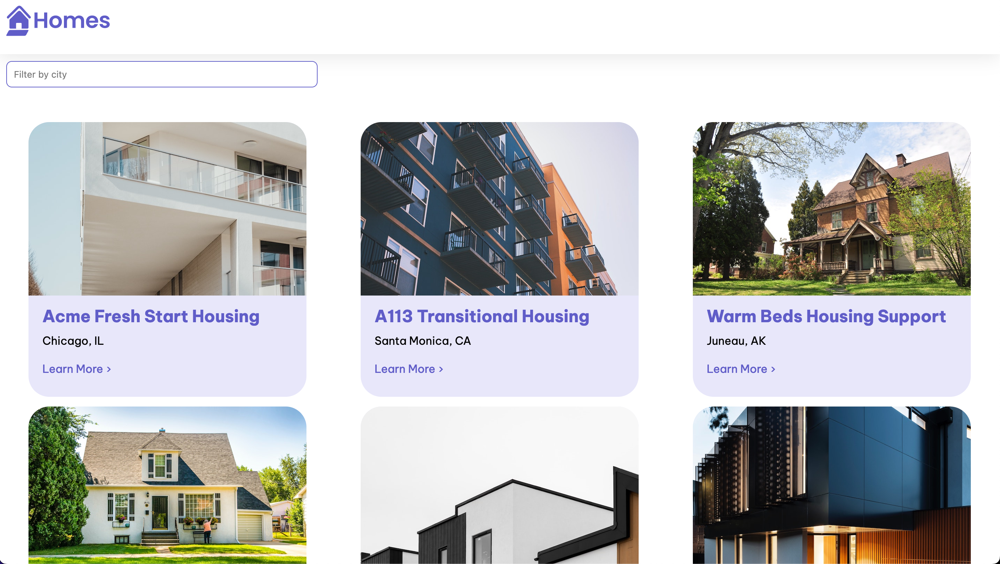

# RxJS Home

A simple project to test out RxJS

## About

This was my first time using RxJS (and TypeScript). Originally, I built this project from a tutorial, [Your first Angular app](https://angular.io/tutorial/first-app).

This was a great learning experience but I also wanted to dive into RxJS. I wanted more of a practical understanding on using Observables, Operators, and the async pipe. I still have a long ways to go and my code is far from perfect, but coming out of this project, I have a better understanding of RxJS.

If you the reader see areas that I can improve on feel free to reach out or make a PR. I'm open and want to improve my skills.

## How to use

This is a super simple home searching app! All you do is search a home by city (Chicago, Oakland, Gary, etc...) and watch the results populate as you type in the input.

Click on 'Learn More' to be redirected to the details page (Note: the form on submit does nothing but console.log the info sent).

Thats it!

## Code I want to highlight

Most of the RxJS action you'll find is in `src/app/location.services.ts`. Specifically this block below...

```ts
export class LocationService {
  private locations$ = new BehaviorSubject<Location[]>([]);

  // ...

  public async init() {
    this.locations$.next(this.allLocations);
    // ^^^ allLocations is an array of Location objects.
  }

  public getLocations(): Observable<Location[]> {
    return this.locations$;
  }

  public getLocationById(id: number): Observable<Location | undefined> {
    return this.locations$.pipe(
      map((locations) => {
        return locations.find((location) => location.id === id);
      })
    );
  }
}
```

This service is injected into `src/app/home/home.comonent.ts` and `src/app/details/details.component.ts` where components can use observables to render correct data.

```ts
// src/app/home/home.comonent.ts

export class HomeComponent {
  public locations$: Observable<Location[] | undefined>;
  public filteredLocations$: Observable<Location[] | undefined>;
  public locationService: LocationService = inject(LocationService);
  public searchForm = new FormGroup({
    query: new FormControl(""),
  });

  filterResults(text: string | null | undefined) {
    if (!text) {
      this.filteredLocations$ = this.locations$;
      return;
    }
    this.filteredLocations$ = this.locationService.filterLocations(text);
  }

  constructor() {
    this.locations$ = this.locationService.getLocations();
    this.filteredLocations$ = this.locations$;

    this.searchForm.valueChanges.subscribe((v) => this.filterResults(v.query));

    this.locationService.init();
  }
}
```

```ts
// src/app/details.component.ts

export class DetailsComponent {
  route: ActivatedRoute = inject(ActivatedRoute);
  locationService = inject(LocationService);
  housingLocation: Location | undefined;

  location$: Observable<Location | undefined>;

  // ...

  constructor() {
    this.location$ = this.route.paramMap.pipe(switchMap((params) => this.locationService.getLocations().pipe(map((locations) => (locations ? locations.find((location) => `${location.id}` === params.get("id")) : null)))));
    this.locationService.init();
  }
  // ...
}
```

Instead of having to subscribe to the observable from the component itself, I used the async pipe in templates

```html
<!-- src/app/home/home.component.html -->

<section class="results">
  <app-housing-location *ngFor="let location of filteredLocations$ | async" [location]="location"> </app-housing-location>
</section>
```

```html
<!-- src/app/details/details.component.html -->

<ng-container *ngIf="location$ | async as location">
  <article>
    
    <section class="listing-description">
      <h2 class="listing-heading">{{ location?.name}}</h2>
      <p class="listing-location">{{location?.city}}, {{location?.state}}</p>
    </section>
    <section class="listing-features">
      <h2 class="section-heading">About this housing location</h2>
      <ul>
        <li>Units available: {{location?.availableUnits}}</li>
        <li>Does this location have wifi: {{ location?.wifi }}</li>
        <li>Does this location have laundry: {{ location?.laundry }}</li>
      </ul>
    </section>
    <section class="listing-apply">
      <h2 class="section-heading">Apply now to live here</h2>
      <form [formGroup]="applyForm" (submit)="submitApplication()">
        <label for="first-name">First Name</label>
        <input id="first-name" type="text" formControlName="firstName" />

        <label for="last-name">Last Name</label>
        <input id="last-name" type="text" formControlName="lastName" />

        <label for="email">Email</label>
        <input id="email" type="email" formControlName="email" />
        <button type="submit" class="primary">Apply now</button>
      </form>
    </section>
  </article>
</ng-container>
```

## Reflection

Overall, I've enjoyed learning this library so far! I've just scratched the surface and still have a lot to understand but this was a great learning experience. To be continued...
